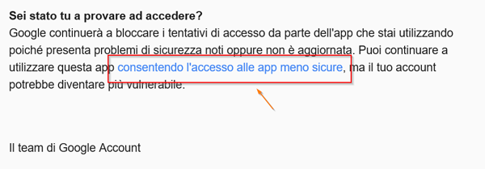

# Inviare E-Mail tramite Gmail
Clona il codice e compila i parametri necessari direttamente nel codice d'esempio.
Non è utilizzato un file di configurazione tipo web.config.  

L’elenco dei parametri da impostare:

```c#
            string to = "to_email@msn.com";
            string from = "from_email@gmail.com";
            string password = "password";
```

## Impostazioni da fare nell'account di google:
Controlla le impostazioni nel tuo Account di GOOGLE e imposta l'accessibilità per app meno sicure.
Login in Google --> Preferenze Account --> Accessibilità --> App e Siti collegati --> Consenti App Meno Sicure


### Passo per passo
1) Dopo avere effettuato il login in Google trovi in alto a destra il tuo avatar.  
Clicca sull'avatar e scegli __Account personale___  
  

2) Sotto la voce __Preferenze account__ scegliere __Accessibilità__:  
  

3) In alto a sinistra nella sezione Accesso e sicurezza trovi la voce __App e siti collegati__:  
  

4) Aziona l'interruttore __Consenti app meno sicure__ su ON:  
  

### Alternativa controllare la posta elettronica
- In alternativa puoi verificare la posta elettronica da GMAIL e seguire i passaggi descritti nel messaggio. Vedi esempio:  
  

Saluti Wuenci